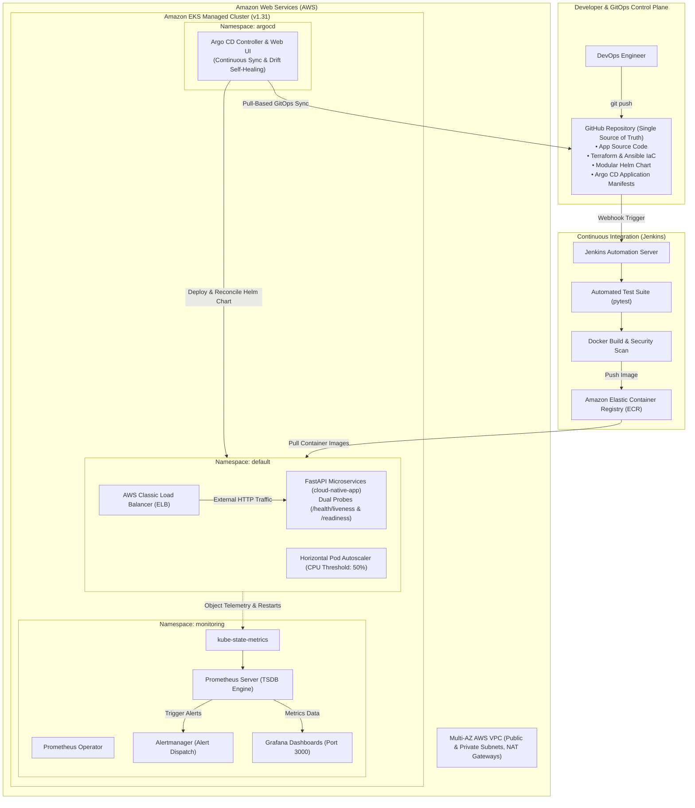

# End-to-End Self-Healing Cloud-Native Platform with GitOps CI/CD on AWS EKS


A production-grade, enterprise-ready cloud-native microservices platform provisioned on **Amazon EKS** via modular **Terraform** and **Ansible**, featuring a **Jenkins CI/CD** pipeline, declarative **Helm** packaging, full-stack **Prometheus & Grafana** observability, and pull-based **Argo CD GitOps** continuous delivery.

The cornerstone of this platform is its **"Triple Self-Healing Architecture"**, engineered to autonomously detect, absorb, and remediate failures across infrastructure, workloads, and configuration drift with zero human intervention.

---

## 1. High-Level Architecture Diagram



---

## 2. Key Capabilities & Technical Highlights

### 1. Infrastructure as Code (IaC) & Configuration Management
* **Modular Terraform:** Provisioned a production-style AWS VPC across 2 Availability Zones with public/private subnet topology, Internet Gateways, NAT Gateways, IAM execution roles, and a managed Amazon EKS cluster with autoscaling node groups.
* **Ansible Automation:** Automated host provisioning, environment hardening, Docker runtime setup, and CI/CD agent tooling with idempotent playbooks.

### 2. Microservice Application & Containerization
* **FastAPI Backend:** Lightweight asynchronous REST API featuring SQLite/PostgreSQL persistence, structured JSON logging, and dedicated chaos engineering endpoints (`/health/fail` for liveness testing, `/stress` for CPU autoscaling simulation).
* **Multi-Stage Dockerfile:** Container image optimized with non-root security context (`UID 10001`), dumb-init process supervisor, and minimal footprint pushed to Amazon ECR.

### 3. Continuous Integration (CI)
* **Declarative Jenkins Pipeline:** Automated end-to-end `Jenkinsfile` orchestrating dependency installation, automated `pytest` test suite execution, semantic container tagging, Docker build, and authenticated Amazon ECR push.

### 4. Kubernetes Packaging & Cloud-Native Primitives
* **Modular Helm Chart (`helm/cloud-native-app`):** Fully parameterized templates for Deployments, ClusterIP/LoadBalancer Services, ConfigMaps, Secrets, HorizontalPodAutoscalers, and dual health probes.
* **Dual Health Probes:** Granular separation between **Liveness Probes** (restarting deadlocked containers) and **Readiness Probes** (removing unhealthy pods from traffic endpoints without killing the process).

### 5. The "Triple Self-Healing" Resilience Architecture
This platform implements 3 distinct layers of automated recovery:
1. **Workload Self-Healing:** Kubelet detects failing liveness probes, isolates traffic, and automatically restarts failed containers in under 20 seconds.
2. **Traffic & Elastic Scaling Self-Healing:** Horizontal Pod Autoscaler (HPA) dynamically scales replicas from 2 to 5 pods when CPU utilization exceeds 50%.
3. **Configuration Drift Self-Healing:** Argo CD continuously monitors live cluster state against Git. If an administrator accidentally deletes or modifies a resource out-of-band, Argo CD reconciles and restores it from Git within seconds.

### 6. Full-Stack Observability & Proactive Alerting
* **`kube-prometheus-stack`:** Deployed Prometheus, Alertmanager, Grafana, and `kube-state-metrics` tailored specifically for resource-constrained AWS nodes (`t3.micro`).
* **Custom Alerting Rules (`monitoring/app-alerts.yaml`):** Implemented Prometheus alerting rules detecting application restarts (`CloudNativeAppPodRestart`) and CPU saturation (`CloudNativeAppHighCPU`).
* **Closed-Loop Verification:** Proved that a simulated pod crash triggers an active alert in Alertmanager, renders real-time step increases in Grafana, heals via Kubernetes, and auto-resolves when the workload stabilizes.

### 7. Declarative GitOps Continuous Delivery (CD)
* **Argo CD Controller:** Transitioned delivery to pull-based GitOps. Application state is defined declaratively in [`argocd/application.yaml`](argocd/application.yaml) pointing to GitHub `main`.
* **Automated Sync & Prune:** Changes pushed to Git automatically synchronize with the cluster, while manual out-of-band drifts are automatically corrected.

---

## 3. Verified Resilience Experiments Matrix

Every self-healing mechanism on this platform was validated through real-world failure simulations:

| # | Experiment | Failure Injection | Observed System Reaction | Recovery Time | Result |
| :-: | :--- | :--- | :--- | :--- | :---: |
| **1** | **Pod Crash / Deletion** | Force-deleted active pod via `kubectl delete pod` | Kubernetes ReplicaSet controller immediately scheduled a replacement pod | **< 6s** | **PASSED** |
| **2** | **Container Deadlock** | Injected HTTP 500 via `POST /health/fail` | Readiness probe isolated pod; Liveness probe failed 3 times; Kubelet auto-restarted container | **18s** | **PASSED** |
| **3** | **Node Drain / Eviction** | Executed `kubectl cordon` & `kubectl drain` on active node | Pods safely evicted and rescheduled onto surviving nodes with **zero HTTP downtime** | **~16s** | **PASSED** |
| **4** | **Traffic Surge (HPA)** | Injected CPU load via `/stress?duration=25` | CPU utilization spiked to 401% (threshold 50%); HPA elastically scaled pods from 2 to 4 | **Dynamic** | **PASSED** |
| **5** | **Alerting & Observability** | Induced microservice failure | Alertmanager fired `CloudNativeAppPodRestart`; Grafana charted metric jump from 0 to 1; auto-resolved | **< 15s** | **PASSED** |
| **6** | **GitOps Drift Healing** | Manually deleted `ConfigMap` via `kubectl delete` | Argo CD detected drift from Git and automatically re-created the ConfigMap | **< 15s** | **PASSED** |

---

## 4. Repository Structure

```text
.
├── Jenkinsfile                          # Declarative CI/CD pipeline definition
├── README.md                            # Complete platform showcase documentation
├── docker-compose.yml                   # Local containerized development stack
├── app/                                 # Microservice application source code
│   ├── main.py                          # FastAPI application & chaos endpoints
│   ├── test_main.py                     # Pytest unit & integration test suite
│   ├── requirements.txt                 # Application runtime dependencies
│   └── Dockerfile                       # Multi-stage, non-root container build
├── terraform/                           # Modular Infrastructure as Code
│   ├── environments/dev/                # Dev environment root module
│   └── modules/                         # Reusable VPC, EKS, IAM, and Security Group modules
├── ansible/                             # Configuration management & host hardening
│   ├── site.yml                         # Master orchestration playbook
│   └── roles/                           # Modular roles (docker, jenkins, aws-tools)
├── helm/                                # Kubernetes Helm Charts
│   └── cloud-native-app/                # Production Helm chart (deployments, probes, HPA)
├── monitoring/                          # Observability & Alerting
│   ├── values-prometheus.yaml           # Lightweight Prometheus/Grafana values for t3.micro
│   └── app-alerts.yaml                  # Custom PrometheusRule alert manifests
├── argocd/                              # GitOps Continuous Delivery
│   └── application.yaml                 # Declarative Argo CD Application manifest
└── scripts/                             # Operational & Lifecycle Automation
    ├── bootstrap.sh                     # Automated cluster bootstrap script (Bash)
    ├── teardown.sh                      # Automated safe cluster teardown script (Bash)
    ├── cleanup.ps1                      # Automated safe cluster cleanup script (PowerShell)
    ├── self_healing_test.sh             # Interactive resilience test suite (Bash)
    └── self_healing_test.ps1            # Interactive resilience test suite (PowerShell)
```

---

## 5. Quickstart & Deployment Guide

### Prerequisites
- [AWS CLI v2](https://docs.aws.amazon.com/cli/latest/userguide/install-cliv2.html) configured with administrative credentials (`aws configure`).
- [Terraform >= 1.5.0](https://developer.hashicorp.com/terraform/downloads)
- [kubectl](https://kubernetes.io/docs/tasks/tools/)
- [Helm v3](https://helm.sh/docs/intro/install/)

### Step 1: Provision Cloud Infrastructure (Terraform)
```bash
cd terraform/environments/dev
terraform init
terraform apply -auto-approve
```

### Step 2: Configure Kubeconfig
```bash
aws eks update-kubeconfig --name cloud-native-eks --region us-east-1
```

### Step 3: Bootstrap Platform Services (Automated)
Run the bootstrap script to deploy Monitoring and Argo CD GitOps in a single command:
```bash
# Linux / macOS / Git Bash:
chmod +x scripts/*.sh
./scripts/bootstrap.sh us-east-1 cloud-native-eks

# Windows PowerShell:
.\scripts\bootstrap.sh us-east-1 cloud-native-eks
```

### Step 4: Access Web Dashboards
Forward the local ports in separate terminal windows:
```bash
# Grafana (User: admin / Password: admin)
kubectl port-forward svc/prometheus-stack-grafana 3000:80 -n monitoring

# Alertmanager UI
kubectl port-forward svc/prometheus-stack-kube-prom-alertmanager 9093:9093 -n monitoring

# Argo CD Web UI (User: admin / Password from secret)
kubectl port-forward svc/argocd-server 8080:443 -n argocd
```

---

## 6. Safe Infrastructure Teardown

To completely decommission the platform and prevent any ongoing AWS cloud billing:

```bash
# Linux / macOS / Git Bash:
chmod +x scripts/teardown.sh
./scripts/teardown.sh us-east-1 cloud-native-eks

# Windows PowerShell:
.\scripts\cleanup.ps1 -Region us-east-1 -ClusterName cloud-native-eks
```

The teardown automation guarantees:
1. Deletes Kubernetes LoadBalancer services first to release AWS Elastic Load Balancers (ELBs).
2. Removes Argo CD and Prometheus Helm releases.
3. Executes `terraform destroy -auto-approve` across all VPC, EKS, and IAM resources.
4. Leaves **$0 ongoing AWS charges**.

---

## 7. License & Author
* **Author:** Cloud / Platform Engineering Team
* **License:** MIT License
